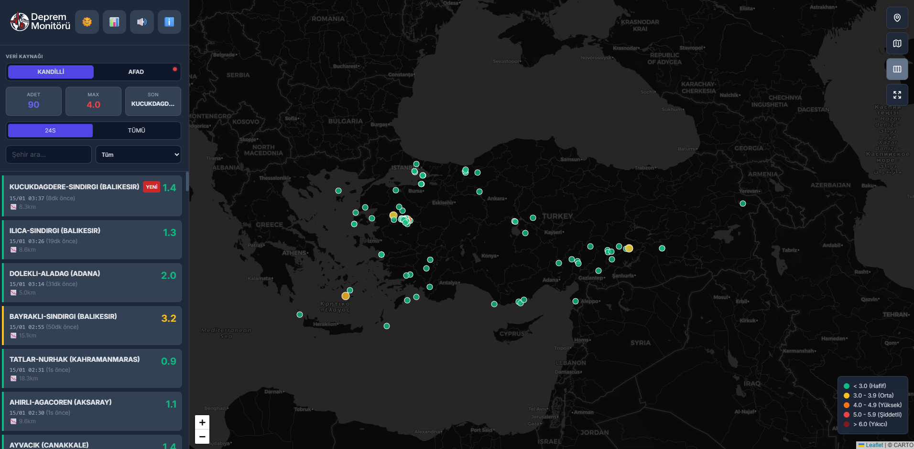
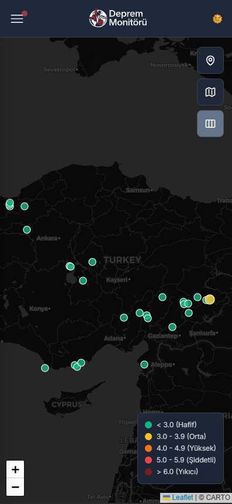

# 🌍 Türkiye Canlı Deprem Monitörü

<div align="center">
  
  
  <p>Türkiye ve çevresindeki depremleri anlık olarak takip edebileceğiniz, modern ve kullanıcı dostu bir web uygulaması.</p>

  
  
  
  
  

  <h3>
    <a href="https://ferhatsavtak.github.io/deprem_monitoru">🚀 Canlı Demo</a>
  </h3>
</div>

---

## ✨ Özellikler

### 📊 Veri Kaynakları
- **Kandilli Rasathanesi** - KOERI canlı deprem verileri
- **AFAD** - Resmi AFAD deprem kayıtları
- Anlık veri senkronizasyonu (30 saniyede bir güncelleme)

### 🗺️ Harita Özellikleri
- İnteraktif Leaflet harita entegrasyonu
- Büyüklük bazlı renkli deprem göstergeleri
- Kümeleme (clustering) desteği
- Konuma göre otomatik odaklanma
- Tam ekran modu
- Özelleştirilebilir harita katmanları (açık/koyu tema)

### 🔔 Bildirim Sistemi
- Yeni depremler için sesli uyarı
- Görsel bildirim banner'ı
- 3.5+ büyüklükteki depremler için otomatik alert
- Dalga animasyonu ile görsel vurgu

### 🎨 Kullanıcı Arayüzü
- Responsive tasarım (mobil ve masaüstü uyumlu)
- Koyu/Açık tema desteği
- Modern ve minimalist arayüz
- Sidebar filtreleme paneli
- Canlı deprem listesi

### 🔍 Filtreleme Özellikleri
- Zaman bazlı filtreleme (24 saat / Tümü)
- Büyüklük filtreleme (3.0+, 4.0+, 5.0+)
- Şehir/bölge bazlı arama
- Gerçek zamanlı liste güncellemesi

### 📈 İstatistikler
- Toplam deprem sayısı
- Maksimum büyüklük
- Son deprem bilgisi
- Grafik görselleştirme (Chart.js)
- Büyüklük bazlı dağılım grafiği

## 🚀 Kurulum

### Gereksinimler
Modern bir web tarayıcısı (Chrome, Firefox, Safari, Edge)

### Kullanım

1. Repoyu klonlayın:
```bash
git clone https://github.com/ferhatsavtak/deprem_monitoru.git
```

2. Proje dizinine gidin:
```bash
cd deprem_monitoru
```

3. `index.html` dosyasını tarayıcınızda açın veya bir web sunucusu kullanın:
```bash
# Python ile basit web sunucusu
python -m http.server 8000

# Node.js ile
npx serve
```

4. Tarayıcınızda `http://localhost:8000` adresine gidin

## 📱 Kullanım Kılavuzu

### Temel Özellikler
- **Veri Kaynağı Seçimi**: Üst menüden Kandilli veya AFAD verilerini seçin
- **Filtreleme**: Zaman aralığı, büyüklük veya şehir bazlı filtreleme yapın
- **Harita Kontrolü**: Sağ taraftaki butonlarla haritayı kontrol edin
  - 📍 Konumum: GPS ile bulunduğunuz yere odaklanır
  - 🗺️ Türkiye Odak: Haritayı Türkiye merkezine getirir
  - 🔲 Kümeleme: Deprem işaretlerini kümeler halinde gösterir
  - ⛶ Tam Ekran: Haritayı tam ekran yapar

### Renk Kodları
- 🟢 **Yeşil** (< 3.0): Hafif depremler
- 🟡 **Sarı** (3.0 - 3.9): Orta şiddette depremler
- 🟠 **Turuncu** (4.0 - 4.9): Yüksek şiddette depremler
- 🔴 **Kırmızı** (5.0 - 5.9): Şiddetli depremler
- 🟤 **Koyu Kırmızı** (≥ 6.0): Yıkıcı depremler

## 🛠️ Teknolojiler

- **HTML5** - Yapısal iskelet
- **Tailwind CSS** - Modern stil framework'ü
- **JavaScript (Vanilla)** - Dinamik işlevsellik
- **Leaflet.js** - Harita görselleştirme
- **Leaflet.markercluster** - Kümeleme desteği
- **Chart.js** - Grafik görselleştirme
- **Orhan Aydoğdu API** - Deprem verisi kaynağı

## 🔗 API Referansı

Proje, [Orhan Aydoğdu API](https://api.orhanaydogdu.com.tr/) kullanmaktadır:

```javascript
// Kandilli Endpoint
https://api.orhanaydogdu.com.tr/deprem/kandilli/live?limit=500

// AFAD Endpoint
https://api.orhanaydogdu.com.tr/deprem/afad/live?limit=500
```

## 🤝 Katkıda Bulunma

1. Bu repoyu fork edin
2. Yeni bir branch oluşturun (`git checkout -b feature/yeniOzellik`)
3. Değişikliklerinizi commit edin (`git commit -am 'Yeni özellik eklendi'`)
4. Branch'inizi push edin (`git push origin feature/yeniOzellik`)
5. Pull Request oluşturun

## 📄 Lisans

Bu proje MIT lisansı altında lisanslanmıştır. Detaylar için [LICENSE](LICENSE) dosyasına bakınız.

## 👨‍💻 Geliştirici

**Ferhat Savtak**

- GitHub: [@ferhatsavtak](https://github.com/ferhatsavtak)

## 🙏 Teşekkürler

- [Orhan Aydoğdu](https://github.com/orhanayd) - API sağlayıcısı
- [Kandilli Rasathanesi](http://www.koeri.boun.edu.tr/sismo/) - Deprem verileri
- [AFAD](https://www.afad.gov.tr/) - Resmi deprem kayıtları

## ⚠️ Güvenlik Uyarıları

### Deprem Anında Yapılması Gerekenler:
- **ÇÖK - KAPAN - TUTUN** yöntemini uygulayın
- Pencerelerden ve cam eşyalardan uzak durun
- Asla merdivenleri kullanmayın
- Asansöre binmeyin

### Acil Durum Telefonları:
- 🚑 **112** - Acil Sağlık Hizmetleri
- 🛡️ **122** - AFAD Afet Hattı

## 📸 Ekran Görüntüleri

### Masaüstü Görünümü


### Mobil Görünümü


## 🔄 Güncellemeler

### v1.0.0 (2026-01-15)
- İlk sürüm yayınlandı
- Kandilli ve AFAD veri kaynakları entegrasyonu
- Harita görselleştirmesi
- Filtreleme ve arama özellikleri
- Ses bildirimleri
- İstatistik grafikleri
- Koyu/Açık tema desteği

---

⭐ Bu projeyi beğendiyseniz yıldız vermeyi unutmayın!

💬 Sorularınız veya önerileriniz için issue açabilirsiniz.
